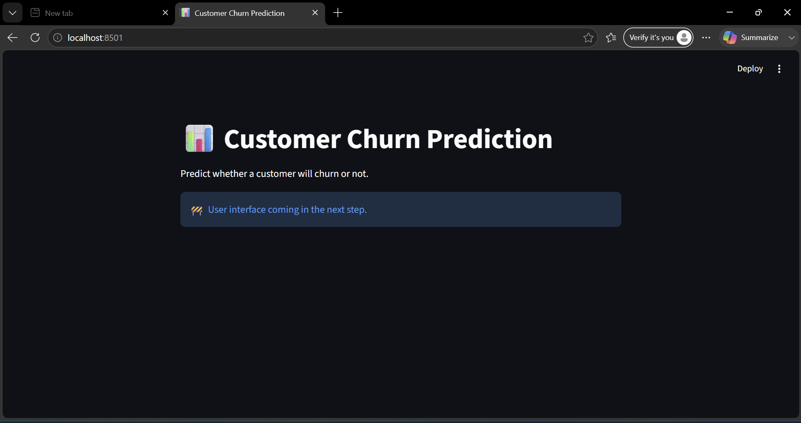
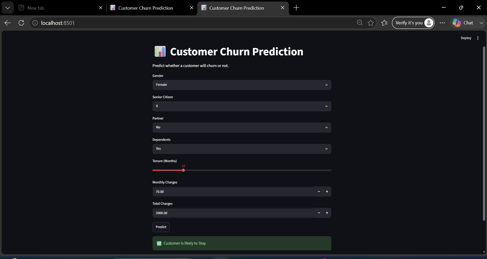
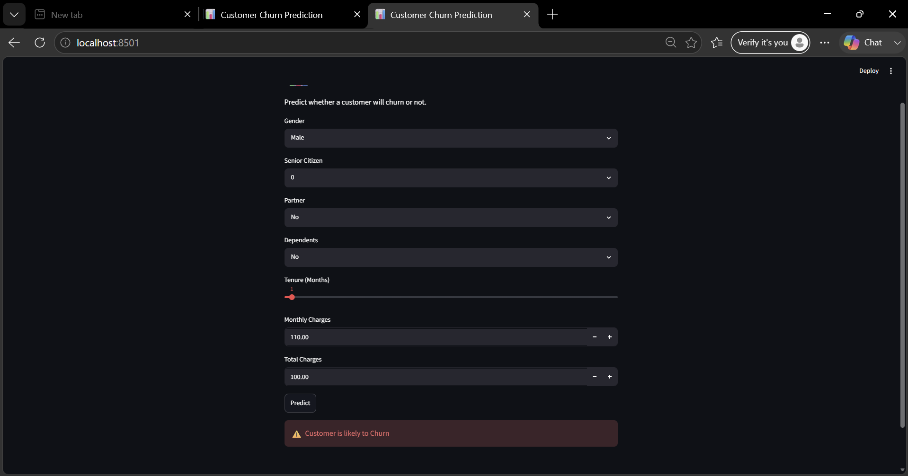

# 📊 Customer Churn Prediction

A Machine Learning web application that predicts whether a customer is likely to leave (churn) or stay with a telecom company. The model is built using Python, Scikit-learn, and Streamlit.

---

## 🚀 Features

- Predict customer churn instantly
- Interactive Streamlit web interface
- Machine Learning based prediction
- User-friendly input fields
- Real-time results
- Clean and responsive UI

---

## 🛠️ Technologies Used

- Python
- Pandas
- NumPy
- Scikit-learn
- Joblib
- Streamlit

---

## 📂 Project Structure

```
Customer_Churn_Prediction/
│
├── dataset/
│   └── churn.csv
│
├── models/
│   └── churn_model.pkl
│
├── screenshots/
│   ├── home.png
│   ├── stay_prediction.png
│   └── churn_prediction.png
│
├── app.py
├── train_model.py
├── requirements.txt
├── README.md
└── .gitignore
```

---

## ⚙️ Installation

Clone the repository

```bash
git clone https://github.com/Atharvajaind/Customer_Churn_Prediction.git
```

Move into the project

```bash
cd Customer_Churn_Prediction
```

Install dependencies

```bash
pip install -r requirements.txt
```

Run the application

```bash
streamlit run app.py
```

---

## 🧠 Machine Learning Workflow

1. Load Customer Churn Dataset
2. Data Cleaning
3. Handle Missing Values
4. Encode Categorical Features
5. Train-Test Split
6. Train Random Forest Classifier
7. Model Evaluation
8. Save Model
9. Build Streamlit Web Application

---

## 📷 Screenshots

### 🏠 Home Page



---

### ✅ Customer is likely to Stay



---

### ❌ Customer is likely to Churn



---

## 📈 Model Performance

- Algorithm: Random Forest Classifier
- Feature Engineering: One-Hot Encoding
- Data Preprocessing Included
- Interactive Prediction Interface

---

## 🔮 Future Improvements

- Deploy on Streamlit Cloud
- Improve model accuracy
- Add probability score
- Add charts and analytics
- Batch prediction using CSV upload

---

## 👨‍💻 Developer

**Atharva Jaind**

BCA (Cloud Computing)

MCA (Artificial Intelligence & Data Science)

GitHub: https://github.com/Atharvajaind

LinkedIn: https://www.linkedin.com/in/atharva-jaind-282169348

---

⭐ If you found this project useful, don't forget to Star this repository.